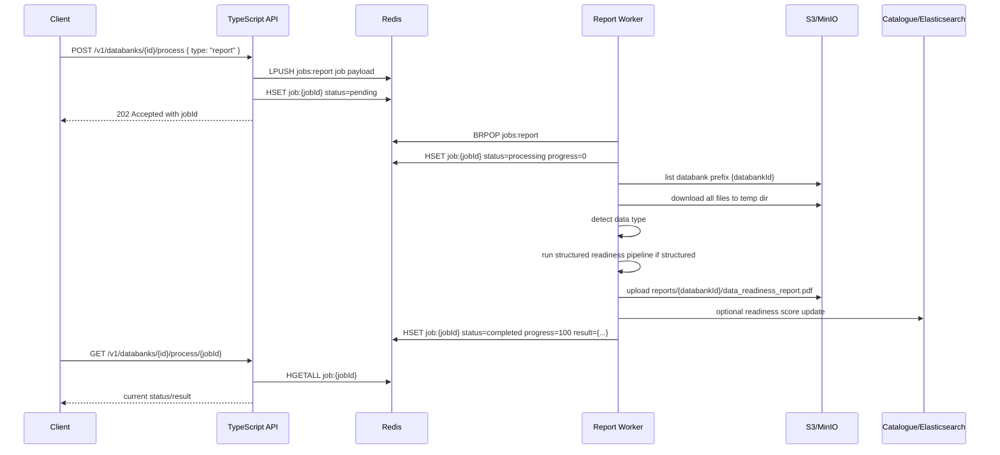

# Report Worker Architecture

## Executive Summary

The report worker is a Python background worker that consumes `report` jobs from Redis, downloads a databank folder from S3 or MinIO, runs the data readiness assessment pipeline, uploads the generated PDF report back to the shared bucket, and writes job status/results back to Redis.

At a high level, the architecture is:

```text
Provider API request
  -> TypeScript API route
  -> Redis list: jobs:report
  -> Python report worker
  -> S3/MinIO databank files
  -> Structured readiness framework
  -> PDF report upload
  -> Redis hash: job:{jobId}
```

The worker is designed for asynchronous, horizontally scalable processing. The API stays responsive by only creating queue entries and status hashes, while one or more report-worker containers block on Redis and perform the heavier file processing.

## Main Components

### API Producer

Relevant files:

- `src/routes/databanks-routes.ts`
- `src/services/processing-service.ts`
- `src/core/utils/job-queue.ts`
- `src/core/utils/redis-client.ts`
- `src/core/validators/schemas.ts`

The API exposes `POST /v1/databanks/:databankId/process`, protected by `authenticate` and `authorize([UserRole.PROVIDER])`. The request body is validated by `createProcessingJobSchema` and accepts:

```json
{
  "type": "zip | report | all",
  "options": {}
}
```

For `type: "report"`, `ProcessingService.createJob()` creates a UUID job ID, initializes a `pending` status, and calls `pushJob("report", jobId, databankId, options)`.

For `type: "all"`, the API creates two separate jobs:

- one `zip` job pushed to `jobs:zip`
- one `report` job pushed to `jobs:report`

The worker never receives `type: "all"`; it receives only a normal `report` job.

### Redis Queue and Status Store

Relevant file:

- `src/core/utils/job-queue.ts`

Redis is used in two ways:

1. Queue list:
   - `jobs:report`
   - API writes with `LPUSH`
   - worker reads with `BRPOP`

2. Status hash:
   - key format: `job:{jobId}`
   - stores status, progress, metadata, error, and result
   - expires after 7 days

Queue payload:

```json
{
  "jobId": "uuid-v4",
  "type": "report",
  "databankId": "databank-id",
  "options": {},
  "createdAt": "2026-04-27T00:00:00.000Z"
}
```

Status hash fields:

```text
jobId
type
status
databankId
progress
createdAt
completedAt
error
result
options
```

Status values are:

- `pending`
- `processing`
- `completed`
- `failed`

### Report Worker Runtime

Relevant files:

- `workers/report-worker/worker.py`
- `workers/report-worker/readiness_processor.py`
- `workers/report-worker/Dockerfile.worker`
- `workers/report-worker/requirements.txt`

The worker is a long-running Python process. `worker.py` is the container entrypoint and runs `worker_loop()`.

The loop:

1. Validates required environment variables:
   - `BUCKET_NAME`
   - `S3_ACCESS_KEY`
   - `S3_SECRET_KEY`
2. Connects to Redis.
3. Reads the queue name from `READINESS_QUEUE_NAME`, defaulting to `jobs:report`.
4. Calls `BRPOP(queue_name, timeout=1)` repeatedly.
5. For each job:
   - parses JSON
   - marks job `processing`
   - invokes `process_readiness_job(databankId)`
   - marks job `completed` or `failed`

The worker supports standalone Redis and Redis Cluster. Cluster mode is enabled with:

```text
REDIS_CLUSTER=true
```

The worker also handles `SIGTERM` and `SIGINT` for graceful shutdown. It checks the shutdown flag every second because `BRPOP` uses a one-second timeout.

## End-To-End Job Flow



## Storage Model

The report worker uses the same `BUCKET_NAME` as the API and zip worker. Storage is partitioned by key prefix, not by separate buckets.

Input:

```text
{databankId}/*
```

Output:

```text
reports/{databankId}/data_readiness_report.pdf
```

The processor downloads every object under the databank prefix into a temporary directory. If a downloaded file ends with `.zip`, the processor extracts it into the temp directory and removes the zip file.

Storage client behavior:

- `STORAGE_PROVIDER=minio` uses `S3_ENDPOINT`, path-style addressing, optional HTTP/HTTPS normalization, and `USE_SSL`.
- `STORAGE_PROVIDER=s3` uses AWS S3 settings such as `S3_REGION`, optional endpoint override, and `S3_VERIFY_SSL`.

## Processing Pipeline

Relevant files:

- `workers/report-worker/readiness_processor.py`
- `workers/report-worker/structured_main.py`
- `workers/report-worker/report/input_handler.py`
- `workers/report-worker/report/aggregate_structured.py`
- `workers/report-worker/report/scoring_structured.py`
- `workers/report-worker/report/json_writer.py`
- `workers/report-worker/report/pdf_writer.py`
- `workers/report-worker/report/multifile_average_score.py`
- `workers/report-worker/report/post_to_cat_api.py`

### 1. Folder Existence Check

`process_readiness_job(databank_id)` first checks that `BUCKET_NAME/{databankId}` exists and is not empty by calling `list_objects_v2` with `MaxKeys=1`.

If the folder is empty or missing, the job returns:

```json
{
  "success": false,
  "error": "Folder not found or empty: ..."
}
```

The worker then marks the Redis job as `failed`.

### 2. Temporary Workspace

The processor uses `tempfile.TemporaryDirectory()` for all downloaded files and generated reports. This keeps worker containers stateless and allows cleanup after each job.

Before invoking the framework, the processor sets:

```text
WORKER_TEMP_DIR={temp_dir}
```

`structured_main.get_output_dir()` uses that value to place reports under:

```text
{temp_dir}/outputReports/{basename(temp_dir)}
```

The processor also attempts to symlink:

```text
{temp_dir}/plots -> /app/plots
```

This lets the PDF generator find the logo assets copied into the worker image.

### 3. Data Type Detection

`determine_data_type()` currently treats a dataset as structured if any downloaded file ends with:

```text
.parquet
.csv
.json
```

If no structured file is present, the current implementation returns `unknown`.

Important current behavior: although `unstructured_main.py` exists and the README describes unstructured processing, `readiness_processor.py` does not call it. Non-structured datasets are not assessed through the unstructured framework. Instead, the worker attempts to update the catalogue readiness score as `NA`, then continues to the upload phase. Because no PDF is generated for unknown datasets, `upload_reports_to_s3()` usually uploads `0` reports while the job can still return `success: true`.

### 4. Structured Data Loading

`report/input_handler.py` loads:

- CSV
- Parquet
- JSON

It skips metadata/documentation-style data files by filename patterns such as:

- `dataset_metadata`
- `README`
- `data_description`
- `data_attributes`
- `column_descriptor`
- names containing `metadata`

Large files over roughly 400 MB are sampled:

- CSV: first 1,000,000 rows
- Parquet: first batch of 1,000,000 rows
- JSON: chunking behavior is used

The loader also scans one level of subdirectories and loads supported data files from them.

### 5. Metric Generation

`report/aggregate_structured.py` builds a raw readiness report by running structured metric modules:

- `structured_metrics/quality.py`
  - column missingness
  - row missingness
  - duplicate rows
- `structured_metrics/relevance_completeness.py`
  - region coverage
- `structured_metrics/variance_correctness.py`
  - numeric variance
  - categorical variation
- `structured_metrics/standardization.py`
  - file format
  - date/timestamp format
  - date/timestamp field presence
- `structured_metrics/documentation.py`
  - documentation presence

OpenAI-based column role inference is present in the codebase but currently disabled in `structured_main.py`:

```text
imputed_columns = None
```

So the current production path uses local non-LLM metrics only, even though `OPENAI_API_KEY` is still documented and passed into the container.

### 6. Scoring and Report Generation

For each loaded dataset:

1. `generate_raw_report()` produces raw metric values.
2. `scoring_structured.compute_aggregate_score()` computes detailed scores and total percentage.
3. `json_writer.write_report_outputs()` writes the raw readiness JSON.
4. `aggregate_structured.generate_final_report()` transforms raw metrics into final report sections.
5. `pdf_writer.generate_pdf_from_json()` creates `data_readiness_report.pdf`.

For multiple loaded files, the worker also generates an averaged readiness report using `multifile_average_score.calculate_average_readiness()`. The averaged PDF overwrites/uses the same final PDF output path:

```text
data_readiness_report.pdf
```

Only the PDF is uploaded by `readiness_processor.upload_reports_to_s3()`. The JSON reports are generated locally in the temp workspace but are not uploaded by the current implementation.

### 7. Catalogue/Elasticsearch Update

The worker can update an external catalogue index after scoring.

Relevant files:

- `workers/report-worker/report/dataset_clean_name_api.py`
- `workers/report-worker/report/post_to_cat_api.py`

`dataset_clean_name_api.py` uses `CAT_API_URL` to resolve a display name and dataset UUID from the databank ID.

`post_to_cat_api.py` updates Elasticsearch when these are available:

- `ELASTICSEARCH_URL`
- `ELASTIC_ID`
- `ELASTIC_PASS`
- optional `ELASTIC_CAT_INDEX`, defaulting to `tgdex__cat`

The update sets fields such as:

- `dataReadiness`
- `dataUploadStatus`
- `publishStatus`
- `lastUpdated`

If credentials or Elasticsearch URL are missing, the catalogue update is skipped without failing the worker job.

## Job Result Contract

On success, `process_readiness_job()` returns a result shaped like:

```json
{
  "success": true,
  "message": "Readiness assessment completed successfully",
  "data_type": "structured",
  "files_processed": 3,
  "reports_uploaded": 1,
  "processing_time_seconds": 12.34,
  "download_time_seconds": 1.23,
  "framework_time_seconds": 10.0,
  "upload_time_seconds": 1.11
}
```

On failure, it returns:

```json
{
  "success": false,
  "error": "error message",
  "processing_time_seconds": 2.34
}
```

The worker stores the result JSON in Redis under `job:{jobId}.result`. The API returns this through:

```text
GET /v1/databanks/{databankId}/process/{jobId}
```

## Deployment Architecture

### Docker Compose

Relevant file:

- `docker-compose.yml`

Local development runs:

- MinIO
- Redis
- zip worker
- report worker

The report worker container:

- builds from `workers/report-worker/Dockerfile.worker`
- depends on healthy Redis and MinIO
- listens on `jobs:report`
- uses MinIO via `http://minio:9000`
- receives `OPENAI_API_KEY`, `CAT_API_URL`, and Elasticsearch settings from environment variables

### Kubernetes

Relevant file:

- `infra/report-worker-deployment.yaml`

Kubernetes configuration declares:

- deployment name: `report-worker`
- namespace: `sandbox`
- default replicas: `2`
- container image placeholder: `your-registry/files-connect-report-worker:latest`
- resource requests:
  - memory: `1Gi`
  - CPU: `500m`
- resource limits:
  - memory: `4Gi`
  - CPU: `2000m`
- termination grace period: `120` seconds
- non-root runtime user: UID `1000`
- HPA:
  - min replicas: `2`
  - max replicas: `10`
  - CPU target: `70%`
  - memory target: `80%`

The Kubernetes manifest reads common configuration from `files-connect-config` and secrets from:

- `files-connect-secret`
- `report-worker-secret`

## Reliability Characteristics

### What Works Well

- The API and worker are decoupled through Redis, keeping request latency low.
- Job status is queryable independently of worker execution.
- Workers are stateless between jobs because they use temporary directories.
- Horizontal scaling is straightforward: multiple workers can block on the same Redis list.
- The worker handles process termination signals and Redis reconnect attempts.
- Redis status hashes expire after 7 days, limiting unbounded status growth.
- The Docker image runs as a non-root user.

### Current Limitations

1. Jobs are popped before processing.

   The worker uses `BRPOP`, which removes the job immediately. If the worker process dies after popping but before writing final status, the job is not automatically requeued.

2. No dead-letter queue.

   Failed jobs are marked `failed`, but there is no separate queue for later inspection or replay.

3. No automatic application-level retry.

   Redis connection retries exist, but failed processing jobs are not retried by the queue layer.

4. Progress is coarse.

   The worker sets `0` when processing starts and `100` on completion. It does not report intermediate progress for download, framework execution, or upload.

5. Options are not used by the report worker.

   The API stores and queues `options`, but `worker.py` only passes `databankId` into `process_readiness_job()`.

6. Unstructured path is currently inactive.

   `unstructured_main.py` and unstructured metric modules exist, but the active processor does not call them.

7. JSON reports are not uploaded.

   The framework creates JSON outputs, but only the PDF is uploaded to object storage.

8. Documentation is slightly ahead of implementation.

   Existing worker docs describe OpenAI inference and unstructured assessments as active, but the current structured path disables OpenAI inference and the processor skips the unstructured framework.

9. Worker callback route is obsolete or underused.

   The API still exposes `PUT /process/:jobId/status`, but the Python worker updates Redis directly rather than calling back to this endpoint.

10. Queue naming is configurable but currently standardized on `jobs:report`.

   Runtime configuration defaults to `jobs:report`, and the active API code pushes report jobs to `jobs:report`.

## Operational Notes

Useful Redis checks:

```bash
redis-cli LLEN jobs:report
redis-cli HGETALL job:<job-id>
redis-cli KEYS 'job:*'
```

Useful Docker checks:

```bash
docker-compose logs -f report-worker
docker-compose logs -f redis
```

Expected storage checks:

```text
Input exists:
BUCKET_NAME/{databankId}/*

PDF output exists after success:
BUCKET_NAME/reports/{databankId}/data_readiness_report.pdf
```

## Recommended Improvements

1. Move from `BRPOP` to a reliable queue pattern.

   Use `BRPOPLPUSH`/processing-list acknowledgement, Redis Streams consumer groups, BullMQ, or another queue that supports acknowledgements, retries, and dead-letter handling.

2. Upload JSON artifacts.

   Upload raw/final JSON reports alongside the PDF, for example:

   ```text
   reports/{databankId}/raw_readiness_report.json
   reports/{databankId}/final_readiness_report.json
   reports/{databankId}/data_readiness_report.pdf
   ```

3. Decide and document the unstructured behavior.

   Either re-enable `unstructured_main.py` in `readiness_processor.py` or update docs/API descriptions to say the current worker only scores structured CSV/Parquet/JSON datasets.

4. Align OpenAI configuration with behavior.

   Since `structured_main.py` currently disables LLM inference, `OPENAI_API_KEY` should be documented as optional unless role inference is restored.

5. Add intermediate progress updates.

   Suggested progress model:

   - 10: storage folder validated
   - 30: download complete
   - 70: framework complete
   - 90: upload complete
   - 100: completed

6. Pass queued `options` into `process_readiness_job()`.

   This would allow future controls such as file filters, force rescore, upload JSON artifacts, sample limits, or choosing structured/unstructured strategy.

7. Add job timeout behavior.

   Long-running or stuck jobs should eventually transition to `failed` with a timeout reason.

8. Add tests around worker contract.

   Useful coverage would include:

   - queue payload parsing
   - missing folder behavior
   - structured dataset success
   - unknown dataset behavior
   - Redis status transitions
   - upload path correctness

## Current Source Map

```text
src/routes/databanks-routes.ts
  HTTP endpoints for creating and polling processing jobs.

src/services/processing-service.ts
  Creates job IDs and delegates queue/status work to job-queue.ts.

src/core/utils/job-queue.ts
  Redis queue push, status hash update, status hash read.

src/core/utils/redis-client.ts
  TypeScript Redis singleton with standalone/cluster support.

workers/report-worker/worker.py
  Python worker loop, Redis blocking pop, status updates.

workers/report-worker/readiness_processor.py
  S3/MinIO download, data type detection, framework invocation, PDF upload.

workers/report-worker/structured_main.py
  Structured readiness pipeline orchestration.

workers/report-worker/report/
  Report aggregation, scoring, JSON writing, PDF writing, catalogue update helpers.

workers/report-worker/structured_metrics/
  Structured data readiness metric implementations.

workers/report-worker/unstructured_main.py
workers/report-worker/unstructured_metrics/
  Present in the repository but not currently invoked by readiness_processor.py.

docker-compose.yml
  Local Redis/MinIO/report-worker wiring.

infra/report-worker-deployment.yaml
  Kubernetes deployment and HPA for report-worker.
```

