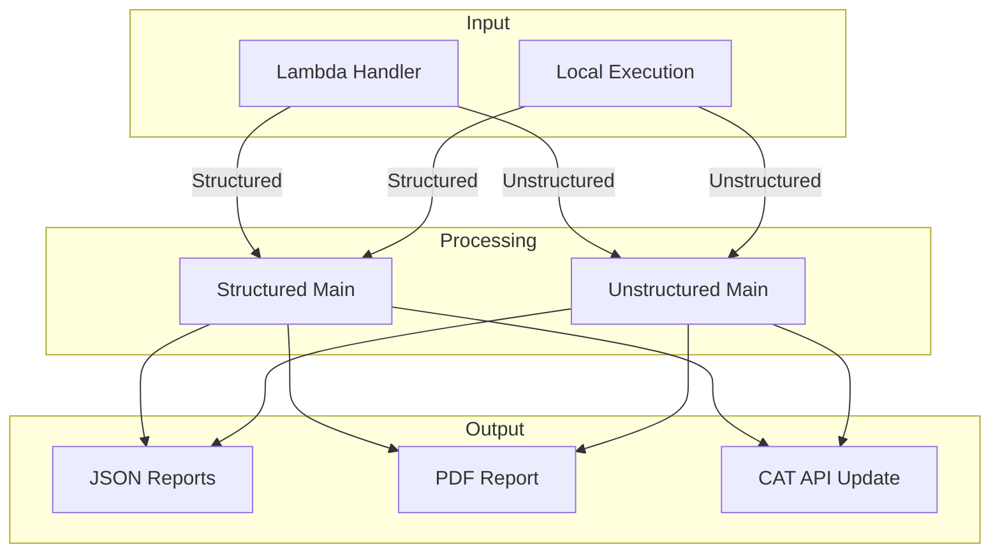
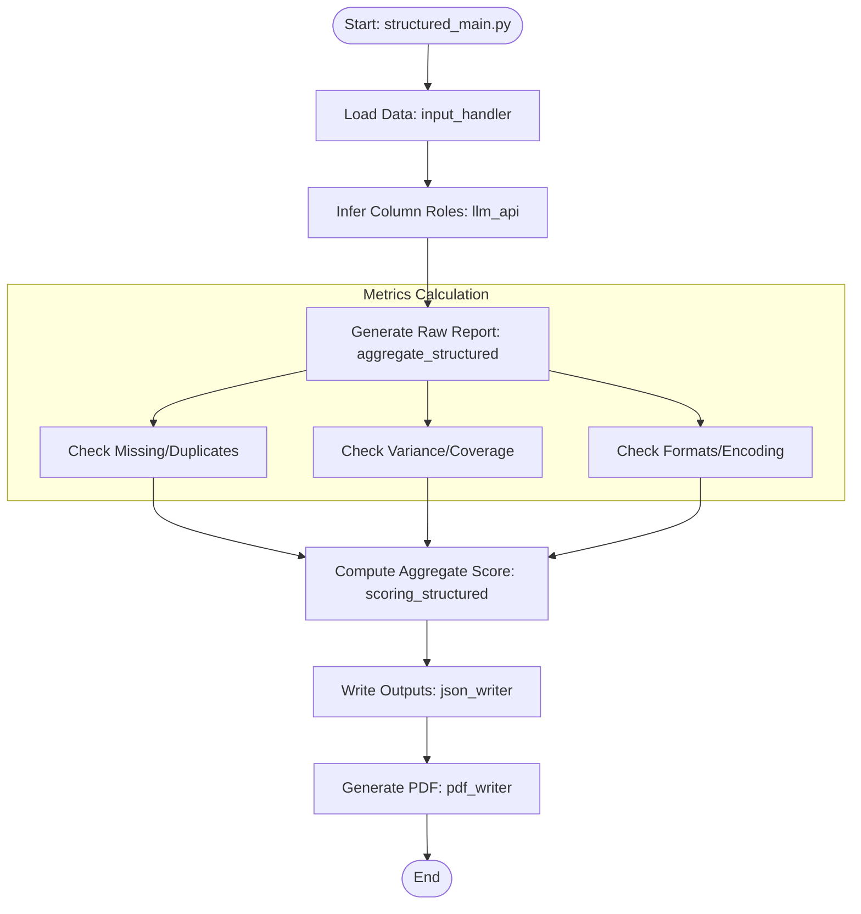
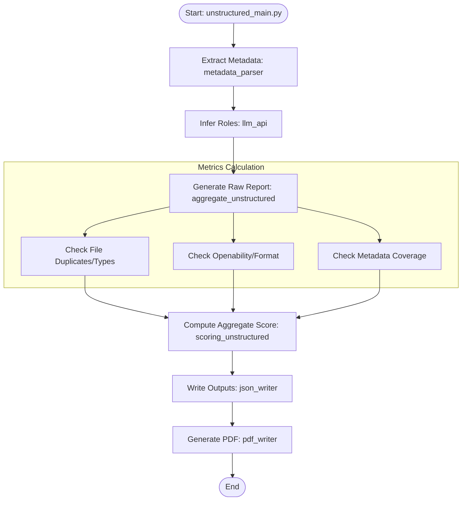

# Report Worker

## Overview

The **Report Worker** is a Redis-based worker application that processes data readiness assessment jobs. It evaluates the quality, readiness, and completeness of both structured (CSV, Parquet, JSON) and unstructured (PDF, Images, Audio, Excel, DICOM) datasets, generating detailed JSON reports and PDF summaries.

## Architecture

```
TypeScript API → Redis Queue (jobs:report) → Report Worker → S3/MinIO
                      ↓
                 Job Status (Redis)
```

## Quick Start

### Using Docker Compose

```bash
# Start the worker
docker-compose up -d report-worker

# Scale to multiple workers
docker-compose up -d --scale report-worker=3

# View logs
docker-compose logs -f report-worker
```

### Standalone

**Note:** For production/development environment deployment, see [DEPLOYMENT.md](./DEPLOYMENT.md) for comprehensive instructions.

```bash
cd workers/report-worker
pip install -r requirements.txt
python worker.py
```

## Configuration

### Required Environment Variables

**Redis:**
- `REDIS_HOST` - Redis hostname (default: `localhost`)
- `REDIS_PORT` - Redis port (default: `6379`)
- `REPORT_QUEUE_NAME` - Queue name (default: `jobs:report`; `READINESS_QUEUE_NAME` is still accepted as a legacy alias)

**Storage:**
- `BUCKET_NAME` - Single bucket for all operations (datasets, zips, and PDF reports)
- `S3_ACCESS_KEY` - Storage access key
- `S3_SECRET_KEY` - Storage secret key
- `STORAGE_PROVIDER` - `s3` or `minio` (default: `s3`)

**OpenAI (Required):**
- `OPENAI_API_KEY` - For column/role inference

**MinIO (if using):**
- `S3_ENDPOINT` - MinIO endpoint (e.g., `http://minio:9000`)
- `USE_SSL` - `true` or `false`

**AWS S3 (if using):**
- `S3_REGION` - AWS region (default: `us-east-1`)

### Optional
- `REDIS_PASSWORD` - Redis authentication
- `REDIS_DB` - Redis database (default: `0`)
- `ELASTIC_ID` / `ELASTIC_PASS` - For CAT API updates

## Job Processing

Jobs are queued in Redis with format:
```json
{
  "jobId": "uuid-v4",
  "type": "report",
  "databankId": "databank-123",
  "createdAt": "2025-01-01T00:00:00.000Z"
}
```

The worker:
1. Downloads files from `BUCKET_NAME/{databankId}/`
2. Auto-detects data type (structured/unstructured)
3. Runs assessment framework
4. Generates JSON and PDF reports
5. Uploads PDF to `{BUCKET_NAME}/reports/{databankId}/data_readiness_report.pdf`
6. Updates job status in Redis

## Module Descriptions

### Core Worker Modules
- **`worker.py`**: Main worker loop. Polls Redis queue and processes jobs.
- **`readiness_processor.py`**: Core processing logic. Handles S3 operations and framework execution.
- **`structured_main.py`**: Structured data assessment entry point.
- **`unstructured_main.py`**: Unstructured data assessment entry point.

### Report Modules (`report/`)
- **`input_handler.py`**: Loads data from directories (supports CSV, Parquet, JSON).
- **`aggregate_structured.py`**: Runs all structured metrics and compiles the raw report.
- **`aggregate_unstructured.py`**: Runs all unstructured metrics and compiles the raw report.
- **`scoring_structured.py` / `scoring_unstructured.py`**: Computes the final weighted scores and percentages.
- **`json_writer.py`**: Saves the raw and final reports to JSON.
- **`pdf_writer.py`**: Generates a visual PDF report from the JSON data.
- **`post_to_cat_api.py`**: Updates an external API (CAT) with the readiness score.

### Metrics Modules
#### Structured Metrics (`structured_metrics/`)
- **`quality.py`**: Checks for missing values (rows/cols) and duplicates.
- **`variance_correctness.py`**: Analyzes numeric variance and categorical distribution.
- **`standardization.py`**: Checks file formats and date/timestamp consistency.
- **`relevance_completeness.py`**: Checks for region coverage.
- **`documentation.py`**: Checks for the presence of data dictionaries/readmes.
- **`llm_api.py`**: Uses OpenAI to infer the semantic roles of columns (e.g., "this is a date", "this is a region").

#### Unstructured Metrics (`unstructured_metrics/`)
- **`metadata_parser.py`**: Extracts metadata from files.
- **`file_format_check.py`**: Validates file extensions.
- **`file_openability.py`**: Tests if files can be opened/read.
- **`file_duplicates.py`**: Checks for duplicate files.
- **`consistency.py`**: Checks if all files in a dataset are of the same type.
- **`llm_api.py`**: Infers roles from metadata.

## Output

For each dataset, generates:
1. **`*_raw_readiness_report.json`**: Detailed metric results
2. **`*_final_readiness_report.json`**: Scored summary
3. **`data_readiness_report.pdf`**: Visual PDF report

PDF is uploaded to: `reports/{databankId}/data_readiness_report.pdf` in `BUCKET_NAME`.

## Features

- ✅ Automatic data type detection
- ✅ Memory-efficient processing
- ✅ Graceful shutdown handling
- ✅ Automatic retry on failures
- ✅ Progress tracking
- ✅ Supports S3 and MinIO
- ✅ Zip file extraction

## Troubleshooting

**Worker not processing:**
- Check Redis: `docker-compose logs redis`
- Check queue: `redis-cli LLEN jobs:report`
- Check logs: `docker-compose logs report-worker`

**Job fails:**
- Verify databank exists in S3
- Check S3 credentials
- Ensure OpenAI API key is set
- Review worker logs for errors

# Data Flow Diagrams

## 1. High-Level Overview
This diagram shows the general flow from entry points to final outputs.



## 2. Structured Data Flow Detail
Detailed flow within the Structured Data processing module.



## 3. Unstructured Data Flow Detail
Detailed flow within the Unstructured Data processing module.


