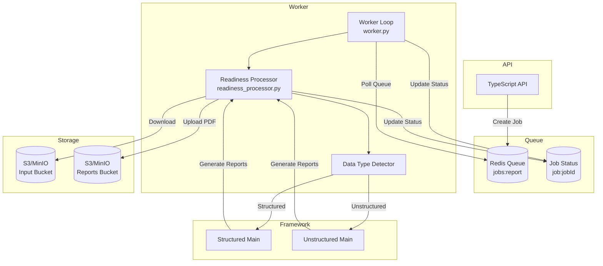
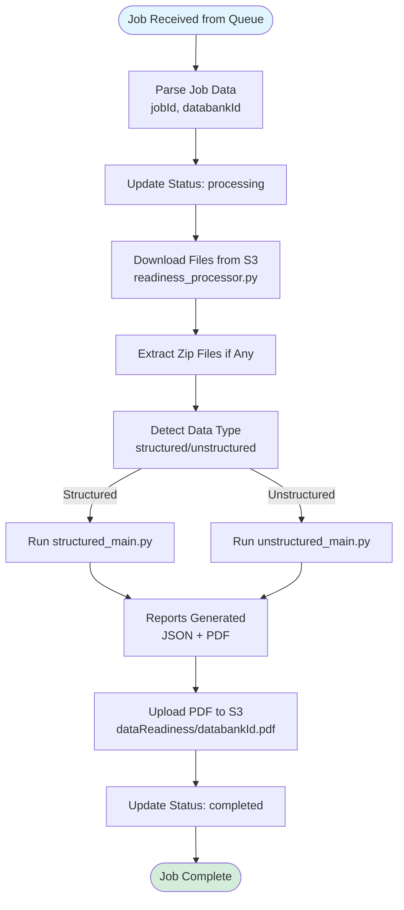
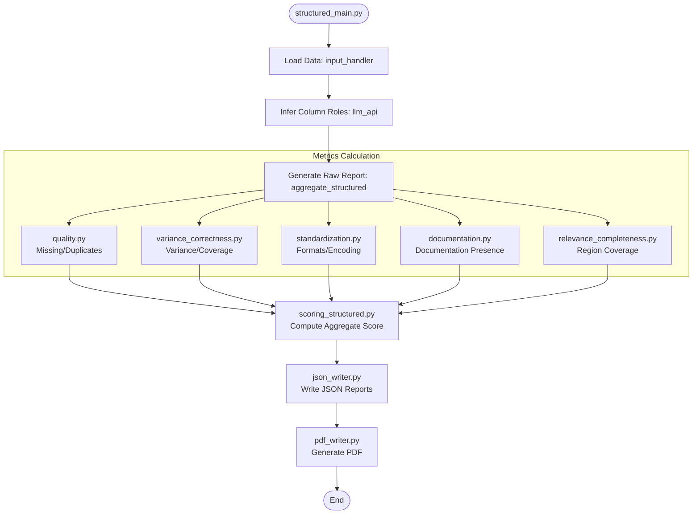
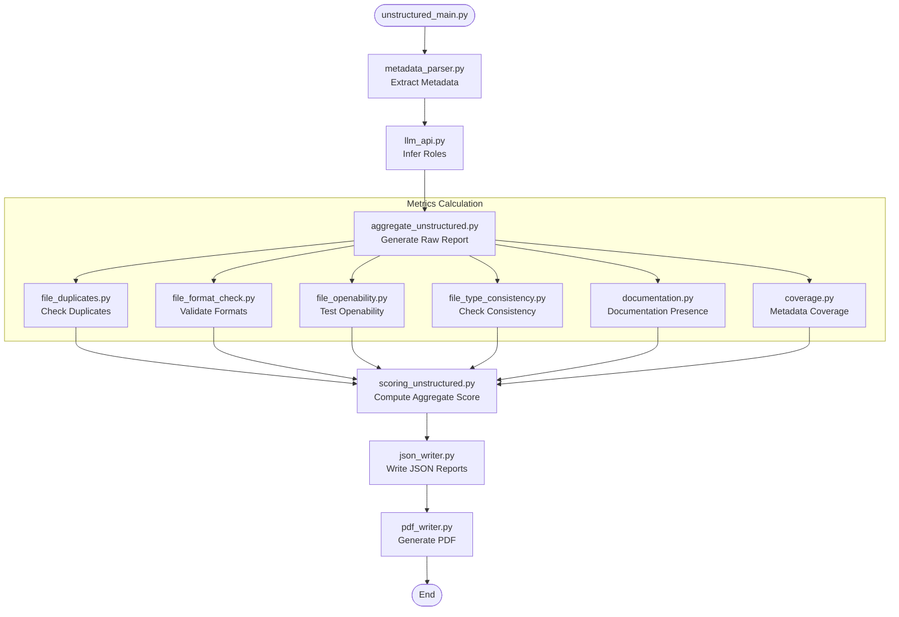

# Data Flow Diagrams

## 1. High-Level Worker Architecture
This diagram shows the Redis-based worker architecture and flow.

## 2. Worker Processing Flow
Detailed flow of how the worker processes a job.

## 3. Structured Data Framework Flow
Detailed flow within the Structured Data assessment framework.

## 4. Unstructured Data Framework Flow
Detailed flow within the Unstructured Data assessment framework.

